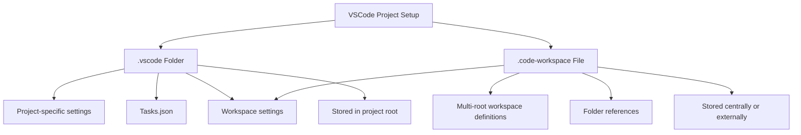

# Content

# + what is th consensus of opinion on workspaces in Visual Studio Code is it bett

source: kilo
session_id: 019c13f9-6e7f-743b-8bc0-4f689ab0bef0
resource: kilo://task/019c13f9-6e7f-743b-8bc0-4f689ab0bef0

# Conversation

- **Task ID:** `019c13f9-6e7f-743b-8bc0-4f689ab0bef0`
- **Source:** kilo
- **Started:** 2026-01-31T12:13:59Z
- **Ended:** 2026-01-31T12:14:34Z
- **Message blocks:** 7
- **Tokens:** 91327 in / 1429 out

---

### 👤 User — 2026-01-31T12:13:59Z

+ what is th consensus of opinion on workspaces in Visual Studio Code is it better to have one central location or a workspace file in each project folder?

### 🤖 Assistant — 2026-01-31T12:14:03Z

Reasoning

The user is asking about VSCode workspaces - specifically whether it's better to have a central workspace location or a workspace file in each project folder. This is an opinion/best practices question about VSCode workspace organization.

Since I'm in "ask" mode, I should provide a thorough explanation of the consensus opinion on this topic. Let me search for current best practices and community consensus on this topic.

I should search for information about VSCode workspace best practices to provide an informed answer.

### 👤 User — 2026-01-31T12:14:05Z

I'll search for the current consensus on VSCode workspace organization to provide you with a well-informed answer.

### 🤖 Assistant — 2026-01-31T12:14:11Z

Reasoning

Based on the search results, I have a good understanding of the consensus opinion on VSCode workspace organization. Let me summarize the key points:

1. There's a distinction between:
   - `.vscode/` folder in project root (contains settings, tasks, launch configs for that project)
   - `.code-workspace` files (multi-root workspace files that can contain multiple folders)

2. The consensus from the search results:
   - `.vscode/` folder should be in each project root - this is where project-specific settings go
   - `.code-workspace` files (multi-root workspaces) are typically stored outside the project folders, in a central location
   - For simple single-folder projects, you don't need a `.code-workspace` file at all
   - For multi-root workspaces (multiple repos/projects together), the workspace file should be outside its root folders

Let me provide a comprehensive answer with a diagram.

### 👤 User — 2026-01-31T12:14:14Z

## VSCode Workspace Organization: Consensus Opinion

Based on community best practices and official documentation, here's the consensus on workspace organization:

### Key Distinction

### The Consensus

| Approach | Best For | Location |
|----------|----------|----------|
| **`.vscode/` folder** | All projects | **Project root** ✅ |
| **`.code-workspace` file** | Multi-repo workspaces | **Central/External** ✅ |

### Detailed Recommendations

1. **`.vscode/` folder in each project** (Strong Consensus)
   - Store project-specific settings, tasks, and debug configurations here
   - This folder **should be committed to version control**
   - Allows team members to share consistent project settings
   - Location: `/project-root/.vscode/settings.json`

2. **`.code-workspace` files** (When needed)
   - Use for **multi-root workspaces** (combining multiple repositories)
   - Store in a **central location** (e.g., `~/workspaces/`)
   - The workspace file is **outside** its constituent folders
   - This follows the semantic hierarchy: workspace > folders

3. **For simple single-folder projects**
   - Don't create a `.code-workspace` file
   - Just use the `.vscode/` folder for settings
   - Open with "File → Open Folder"

### Why This Approach?

- **`.vscode/` in project**: Settings travel with the project, enabling team collaboration and consistent environments
- 
