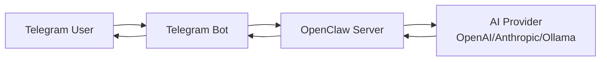

# Content

# Explain to me how I configure openclaw to respond to messages from Telegram, giv

source: kilo
session_id: 019c6303-6710-7456-8ad8-a03d68f020eb
resource: kilo://task/019c6303-6710-7456-8ad8-a03d68f020eb

# Conversation

- **Task ID:** `019c6303-6710-7456-8ad8-a03d68f020eb`
- **Source:** kilo
- **Started:** 2026-02-15T20:34:53Z
- **Ended:** 2026-02-20T03:48:51Z
- **Message blocks:** 161
- **Tokens:** 6465869 in / 29242 out

---

### 👤 User — 2026-02-15T20:34:53Z

Explain to me how I configure openclaw to respond to messages from Telegram, give examples.

### 🤖 Assistant — 2026-02-15T20:35:09Z

<details><summary>Reasoning</summary>

The user is asking about configuring "openclaw" to respond to messages from Telegram. I'm not familiar with "openclaw" - this could be a specific project or tool. Let me search for information about this to provide accurate guidance.

First, I should search for openclaw to understand what it is and how it works with Telegram integration.

</details>

### 👤 User — 2026-02-15T20:35:09Z

I need to search for information about "openclaw" and its Telegram integration capabilities. Let me look this up.

### 🤖 Assistant — 2026-02-15T20:35:21Z

<details><summary>Reasoning</summary>

I found good search results about OpenClaw and Telegram configuration. Let me get more detailed information from the official documentation to provide a comprehensive answer.

</details>

### 👤 User — 2026-02-15T20:35:21Z

Let me get more detailed information from the official OpenClaw documentation.

### 🤖 Assistant — 2026-02-15T20:35:44Z

<details><summary>Reasoning</summary>

I have gathered good information about OpenClaw and Telegram configuration. Let me now provide a comprehensive answer with examples based on the search results.

</details>

### 👤 User — 2026-02-15T20:35:44Z

# Configuring OpenClaw to Respond to Telegram Messages

OpenClaw is a personal AI assistant that can be connected to Telegram, allowing you to interact with AI through Telegram messages. Here's a comprehensive guide on how to configure it.

## Overview: How OpenClaw Telegram Integration Works



## Step 1: Create a Telegram Bot

Before configuring OpenClaw, you need to create a Telegram bot:

1. Open Telegram and search for **@BotFather** (verify the handle is exactly `@BotFather`)
2. Send the command `/newbot`
3. Follow the prompts to name your bot
4. **Save the bot token** provided by BotFather (format: `1234567890:ABCdefGHIjklMNOpqrsTUVwxyz`)

### Important BotFather Settings

```bash
/setjoingroups     # Allow/deny adding bot to groups
/setprivacy OFF    # IMPORTANT: Set to OFF so bot sees all group messages
                  # If ON, bot only sees mentions and commands
```

## Step 2: Configure OpenClaw for Telegram

### Method A: Configuration File

Edit your OpenClaw configuration file to include the Telegram channel:

```json
{
  "channels": {
    "telegram": {
      "enabled": true,
      "dmPolicy": "open",
      "allowFrom": ["*"],
      "botToken": "YOUR_BOT_TOKEN_HERE",
      "groupPolicy": "allowlist",
      "streamMode": "partial"
    }
  }
}
```

### Method B: CLI Configuration

```bash
# Add Telegram provider with your bot token
docker compose exec openclaw-gateway node dist/index.js providers add --provider telegram --token YOUR_BOT_TOKEN
```

### Method C: Using the Setup Wizard

During initial setup, you'll be prompted:
1. Enter the Telegram Bot token from BotFather
2. Select "Yes" to confirm
3. Select your preferred package manager (npm recommended)
4. Select additional skills to install

## Step 3: Pair Your Telegram Account

OpenClaw requires pairing to authorize users:

```bash
# Using Docker
docker compose run --rm openclaw-cli pairing approve telegram <CODE>

# The CODE comes from messaging your bot with /start
```

## Configuration Options Reference

### Core Configuration Structure

```json
{
  "channels": {
    "telegram": {
      "enabled": true,
      "botToken": "YOUR_BOT_TOKEN",
      "dmPolicy": "open",
      "groupPolicy": "allowlist
